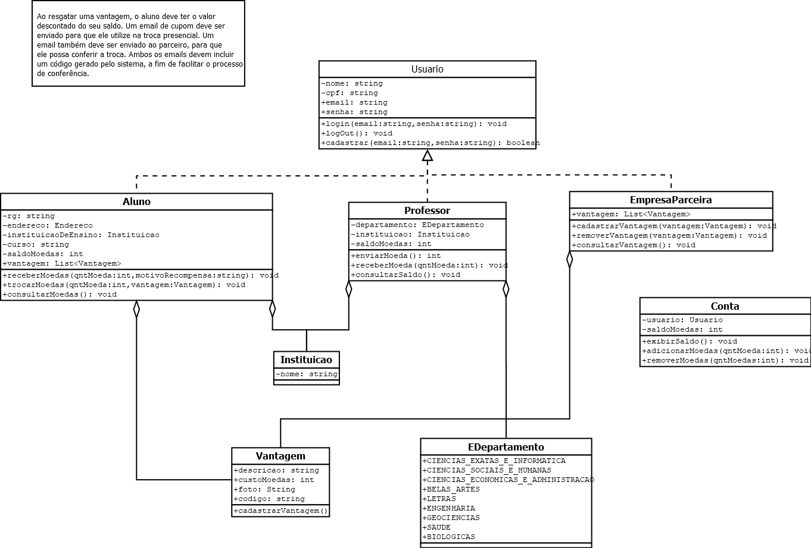
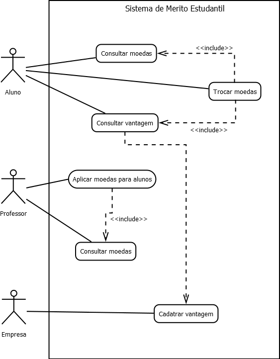

# Sistema de mérito estudantil

## Requisitos do Sistema

## História de usuário

Como aluno, quero me cadastrar no sistema de mérito, receber moedas dos professores por bom comportamento, ver meu saldo, trocar moedas por vantagens, e receber notificações por email. Como professor, quero enviar moedas aos alunos, consultar meu saldo, ver as transações e notificar os alunos. Como empresa parceira, quero me cadastrar, oferecer vantagens, receber notificações de trocas e conferir os resgates. Todos devem fazer login e autenticação para acessar o sistema.

## Diagrama de Classe

## Diagrama de Caso de Uso

# Requisitos para executar a aplicação

## BackEnd

Para executar o backend da aplicação, é necessário ter instalado:

- .net (https://dotnet.microsoft.com/pt-br/download)
- sql Server (https://info.microsoft.com/ww-landing-sql-server-2022.html?culture=en-us&country=us)
- Visual Studio 2022 (https://visualstudio.microsoft.com/pt-br/downloads/)
- - Instale a versão community

#### Git Clone

No repositório desejado, aba o terminal e efetue o comando:

> git clone https://github.com/pinheiro09igor/students-merits.git >  
> Após o clone do projeto, conecte-se ao banco:

- Acesse o SQL Server Management Studio
- Conecte-se

Após isso, conecte-se ao back:

- Acesse o repositório onde o backend está hospedado (...\students-merits\codigo\backend)
- Abra o arquivo backend.sln
- - Esse arquivo o levará ao Visual Studio

Atualize o banco:

- Acesse o repositório onde o backend está hospedado (...\students-merits\codigo\backend) e execute o comando:
  > dotnet ef migrations add name
  >  
  > dotnet ef database update

Após isso, execute o backend da aplicação

- Acesse novamente o Visual Studio que foi aberto a partir do arquivo backend.sln
- Execute através do botão '> Http' na parte superior do Visual Studio
- - Esse processo o direcionará para http://localhost:3000/swagger/index.html, onde as APIs da aplicação poderão ser visualizadas e testas através do Swagger.

## FrontEnd

Para executar o backend da aplicação, é necessário ter instalado:

- Node (https://nodejs.org/en/download/)

Instale as dependências do front da aplicação:

- Acesse o repositório onde o frontEnd da aplicação se encontra (...\merito-estudantil\students-merits\codigo\front)
- Acesse o terminal e efetue o comando:
  > npm i

Com o backEnd e o banco de dados conectados, acesse o front da aplicação:

- No repositório do front da aplicação execute no terminal:
  > npm run dev
  > o
